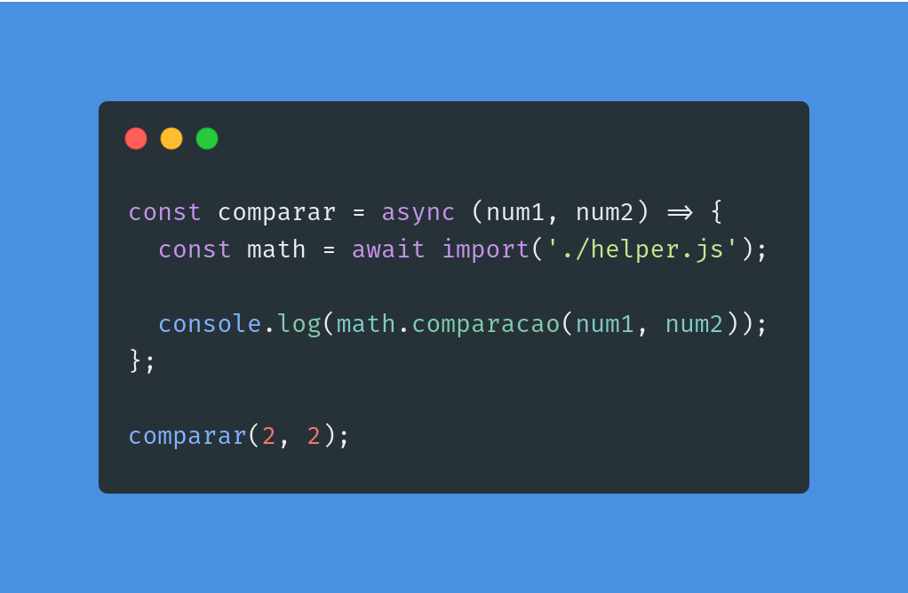

<h1 align="center">
  ECMAScript 2020 (ES 11)
</h1>

# Objetivo

- Mostrar a implementação de novas funcionalidades da linguagem javascript e ajudar comunidade.

## Configuração

Para isso vamos instalar o sucrase para que seja mais o fácil possível de usar a última versão do JavaScript ao rodar os exemplos digite no terminal: sucrase-node nomeDoArquivo.

## 1 => Dynamic Import

A importação dinâmica retorna uma promessa com o módulo e você poderá usar tanto then/catch ou async/await.

Arquivo importado.

  

Exemplo da nova funcionalidade.

  

## 2 => Promise.allSettled

Quando temos que trabalhar com várias promises as vezes fica difícil saber se todas terminaram e deram certo. Usando Promise.allSettled podemos criar uma nova promessa que retornará apenas quando todas forem concluidas o que facilita bastante.

  

## 3 => Operador de coalescência nulo

Antes não havia um modo prático e nativo de testar por exemplo se uma variável que contém uma string está vazia ou se uma que contém um número está zerado. Agora esse tipo de operação foi muito facilitado pela inclusão do operador de coalescência que tem valores iniciais de cada tipo.

  

## 4 => Operador de encadeamento opcional

Lembra quando você foi pega um atributo de um objeto e validou o tipo dele mais não o caminho até lá e depois estourou erro porque esse caminho não existia, então esse operador resolve esse problema devolvendo undefined ao invés de uma exception.

  

